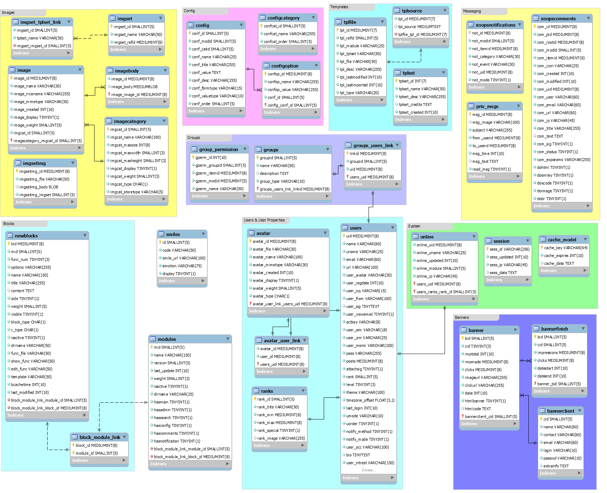

# Database

This is a high level view of the XOOPS Database

To learn how to use XOOPS Classes to access database in a module, please read this:

* [Using Criteria classes](/database/usingclasses.md)
