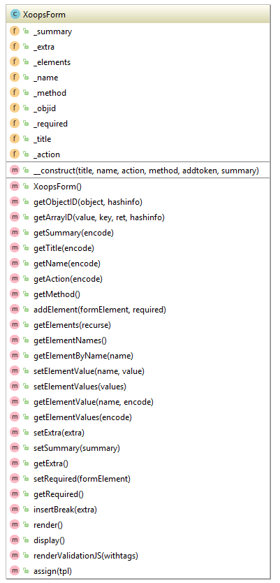

## XoopsForm

XoopsForm is an Abstract base class for XOOPS forms

#### Definition
```php
XoopsForm( string $title, string $name, string $action, string $method = "post" )
```

#### Most Important Methods
*   **addElement()** - Add an XOOPS Form Element to the form
*   **assign()** - assign to smarty form template instead of displaying directly
*   **display()** - displays rendered form
*   **render()** - returns renderered form




