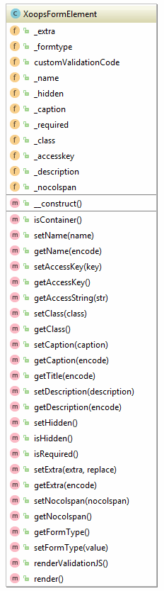

## XoopsFormElement

#### Definition
```php
XoopsFormElement( )
```

#### Most Important Methods
*   setAccessKey() - set the "accesskey" attribute for the element
*   setClass() - set the "class" attribute for the element
*   setExtra() - Add extra attributes to the element.
*   setHidden() - flag the element as "hidden"

Apart from these methods, most important information is given in the constructor of child classes.

XoopsFormElement is an abstract class and should not be instantiated manually.



