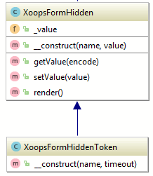

## XoopsFormHiddenToken


**Definition**
```php
function XoopsFormHiddenToken($name = 'XOOPS_TOKEN_REQUEST', $timeout = 360)
```

**Usage**

This class is a subclass to XoopsFormHidden that only has a constructor for building a XoopsFormHidden object with a name and a token value generated by the XoopsSecurity class.

The name value defaults to XOOPS_TOKEN_REQUEST and the second parameter controls how long (in seconds) the token is valid




