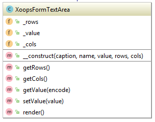

## XoopsFormTextArea

**Definition**
```php
XoopsFormTextArea($caption, $name, $value="", $rows=5, $cols=50, $id = "")
```

**Usage**
This class show a multiline text input area (aka textbox) with caption. Text box size is specified by $rows and $cols parameters.




