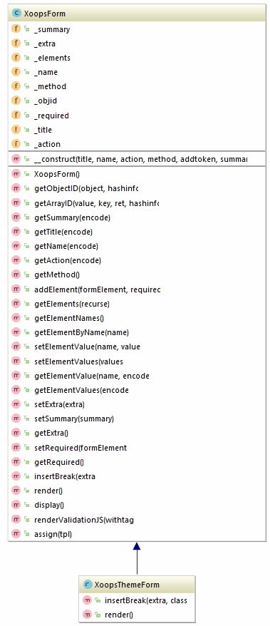

## XoopsThemeForm

**Definition**
```php
XoopsThemeForm( string $title, string $name, string $action, string $method = "post" )
```

**Usage**
Inherits from XoopsForm and will render the form using tables and current theme stylesheet. 

**Full Example:**
```php
include XOOPS_ROOT_PATH."/class/xoopsformloader.php";
$form = new XoopsThemeForm('Title of form', 'formname', 'targetpage.php', 'POST');
$form->addElement(new XoopsFormText('Field Label:', 'fieldname'));
$form->display();
```




