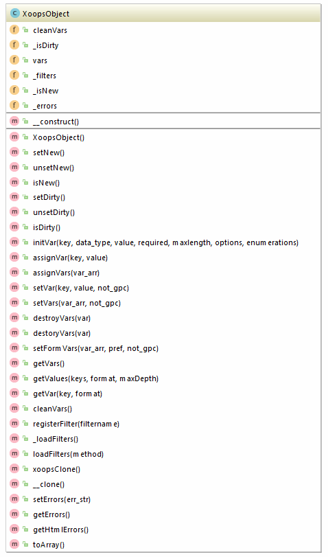

## XoopsObject

#### Definition
XoopsObject () Abstract class

#### Usage
XoopsObject should be handled as an abstract class and has the following useful functions:
    * **initVar($key,$data_type,$value,$required,$maxlength,$options)** - initialize a variable. Use this, when extending XoopsObject instead of declaring variables the normal way. for $data_type, see below. $options is string for select options
    * **getVar($key,$format)** - retrieves an object variable ($format is 's' for display on page, 'f' for form info, or 'n' for no cleaning.
    * **getVars()** - retrieves array of key=>value pairs
    * **cleanVars()** - "cleans" the object variables, which have changed, according to their type set in initVar()
    * **clone()** - create a clone(copy) of the current object
    * **setVar($key,$value,$not_gpc) **- assign a value $value to a variable $key; sets object dirty
    * **setVars($var_array)** - assign values to variables from a key=>value pair array; sets object dirty
    * **assignVar($key,$value) **- assign a value to a variable
    * **assignVars($var_array)** - assign values to variables from a key => value pair array

The last two functions are for new(-ly instantiated) objects. For existing objects, which are subsequently modified, you should use setVar() and setVars() - this will set the object status to "dirty" i.e. that it has been modified and variable values not sanitized.

Data Types (for initVar function above):

   * XOBJ_DTYPE_TXTBOX - Text Box
   * XOBJ_DTYPE_TXTAREA - Text Area
   * XOBJ_DTYPE_INT - Integer
   * XOBJ_DTYPE_URL - URLs
   * XOBJ_DTYPE_EMAIL - E-mails
   * XOBJ_DTYPE_ARRAY - Arrays
   * XOBJ_DTYPE_OTHER - Others (won't be cleaned)
   * XOBJ_DTYPE_SOURCE -
   * XOBJ_DTYPE_STIME - Short Time
   * XOBJ_DTYPE_MTIME - Medium Time
   * XOBJ_DTYPE_LTIME - Long Time**

Note
Don't give, to a field's name of your table, the table's name or you will have a problem in the XoopsObject class while saving the datas
