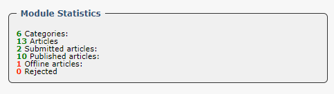

# ModuleStats

This trait calls the Configurator class and if there is a ModuleStats array, then it gets it.

```php
trait ModuleStats
{
    /**
     * @param \XoopsModules\xxxxx\Common\Configurator $configurator
     * @return array
     */

    public static function getModuleStats($configurator)
    {
        $moduleStats = [];
        if (\count($configurator->moduleStats) > 0) {
            foreach (\array_keys($configurator->moduleStats) as $i) {
                $moduleStats[$i] = $configurator->moduleStats[$i];
            }
        }

        return $moduleStats;
    }
}
```

The ModuleStats are defined in /config/config.php file. For example, for Publisher, the stats are defined as:

```php
    'moduleStats'  => [
        'totalcategories' => $helper->getHandler('Category')->getCategoriesCount(-1),
        'totalitems'      => $helper->getHandler('Item')->getItemsCount(),
        'totalsubmitted'  => $helper->getHandler('Item')->getItemsCount(-1, Constants::PUBLISHER_STATUS_SUBMITTED),
        'totalpublished'  => $helper->getHandler('Item')->getItemsCount(-1, Constants::PUBLISHER_STATUS_PUBLISHED),
        'totaloffline'    => $helper->getHandler('Item')->getItemsCount(-1, Constants::PUBLISHER_STATUS_OFFLINE),
        'totalrejected'   => $helper->getHandler('Item')->getItemsCount(-1, Constants::PUBLISHER_STATUS_REJECTED),
    ],
```
resulting in this view:


