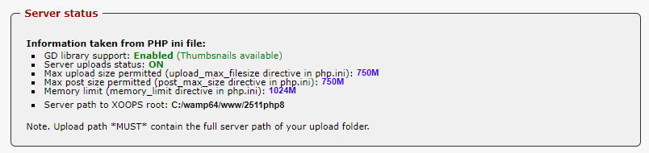

# ServerStats

Provides standard server stats, e.g. 

* GD library support: Enabled 
* Server uploads status: ON
* Max upload size permitted \(upload\_max\_filesize directive in php.ini\): **2M**
* Max post size permitted \(post\_max\_size directive in php.ini\): **8M**
* Memory limit \(memory\_limit directive in php.ini\): **128M**
* Server path to XOOPS root: **C:/wamp64/www/mymodule**

