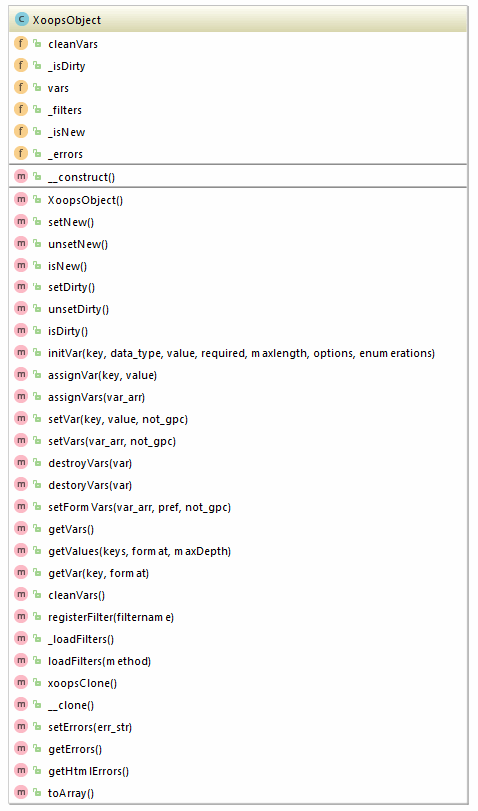
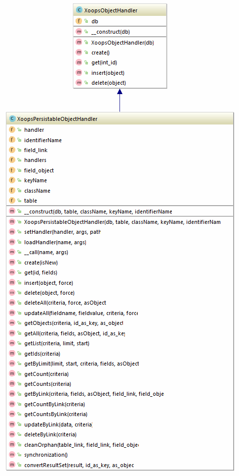

# Key Classes/Objects API

## Key Classes/Objects API

**Using Xoops API**

In addition to the Xoops API documentation [http://api.xoops.org/](http://api.xoops.org/) here we also need guidelines for module writers as to what classes to use when, why, and how, etc. For example:

* XoopsObject Data Access classes

If you create a module class \(in the class folder of your module\) called `Myclass` that extends `XoopsObject`:

```php
<?php

namespace XoopsModules\Mymodule;

class Myclass extends \XoopsObject
{
    /**
    * Constructor
    **/
    public function __construct() // Constructor
    {
    $this->initVar('my_variable', XOBJ_DTYPE_INT, NULL);
    }
}
```

In a separate file we create a handler called `MyclassHandler` that extends XoopsPersistableObjectHandler:

```php
<?php

namespace XoopsModules\Mymodule;

class MyclassHandler extends \XoopsPersistableObjectHandler
   {
   }
```

you can then obtain a reference to an instance of the handler class like this: In /modules/module/index.php:

```php
<?php

namespace XoopsModules\Mymodule;

$myclassHandler = new Mymodule\MyclassHandler();
```

Built in data object handlers can be obtained via xoops\_gethandler\(''\). Search for the use of this idiom in other modules for an idea of how these classes let you build data access objects to interface with corresponding database tables.






