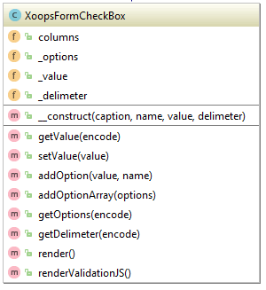

## XoopsFormCheckBox

```php
// Display checkbox, initially checked.
$checked_value = 1;
$checkbox1 = new XoopsFormCheckBox(, 'box1', $checked_value);
$checkbox1->addOption($checked_value, _MD_MODNAME_CHECK_ME);
$form->addElement($checkbox1);


// Display checkbox, initially unchecked.
$checked_value = 1;
$checkbox2 = new XoopsFormCheckBox(, 'box2', !$checked_value);
$checkbox2->addOption($checked_value, _MD_MODNAME_CHECK_ME);
$form->addElement($checkbox2);
```

Assuming the form's method is POST:

If box 1 is checked, the submitted form will have 
$_POST['box1'] = 1. 
Otherwise $_POST['box1'] will be undefined.

If box 2 is checked, the submitted form will have 
$_POST['box2'] = 1. 
Otherwise $_POST['box2'] will be undefined.




