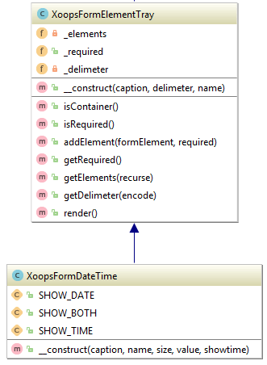

## XoopsFormDateTime

**Definition**

```php
 XoopsFormDateTime(mixed $caption, mixed $name, mixed $size = 15, mixed $value = 0 );
```

**Usage**
This element will show a date in a text field with a button for bringing up a JavaScript calendar. If no value is given, the element will default to a timestamp found with time() When receiving values from this element, it will come in an array with two indexes: 'date' and 'time', so to get that into a usable timestamp, do the following:

```

   $var_name = strtotime($var_name['date']) + $var_name['time'];
   
```




