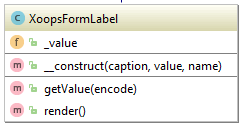

## XoopsFormLabel

**Definition**
```php
XoopsFormLabel($caption="", $value="")
```

**Usage**
This class prints a label, which is really just a piece of text.

This can be used with good effect instead of a XoopsFormText field if you do not want the field to be editable, e.g. in the case of an editing of a form, where you want to keep data from the first input and let it be transparent to the user, that the data is saved. back to Main Page




