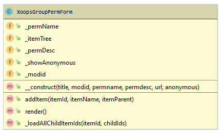

# XoopsGroupPermForm

XoopsGroupPermForm renders a form for setting module-specific group permissions



#### Definition
```php
class XoopsGroupPermForm extends XoopsForm
{
    /**
     * Module ID
     *
     * @var int
     */
    public $_modid;
    /**
     * Tree structure of items
     *
     * @var array
     */
    public $_itemTree = array();
    /**
     * Name of permission
     *
     * @var string
     */
    public $_permName;
    /**
     * Description of permission
     *
     * @var string
     */
    public $_permDesc;

    /**
     * Whether to include anonymous users
     *
     * @var bool
     */
    public $_showAnonymous;

    /**
     * Constructor
     * @param        $title
     * @param        $modid
     * @param        $permname
     * @param        $permdesc
     * @param string $url
     * @param bool   $anonymous
     */
    public function __construct($title, $modid, $permname, $permdesc, $url = '', $anonymous = true)
    {
        parent::__construct($title, 'groupperm_form', XOOPS_URL . '/modules/system/admin/groupperm.php', 'post');
        $this->_modid    = (int)$modid;
        $this->_permName = $permname;
        $this->_permDesc = $permdesc;
        $this->addElement(new XoopsFormHidden('modid', $this->_modid));
        $this->addElement(new XoopsFormHiddenToken($permname));
        if ($url != '') {
            $this->addElement(new XoopsFormHidden('redirect_url', $url));
        }
        $this->_showAnonymous = $anonymous;
    }
```


