# ModuleAdmin Framework 


1. Preamble 
2. Installation
3. Usage   
   3.1. Configuration of xoops_version.php
 
   3.2. Configurations of the usage of the Frameworks

     3.3. The admin menu

    3.4. The help section of the module

    3.5. Addition of a info box
   
    3.6. Addition of a navigation

     3.7. Addition of a button

    3.8. The page "index.php"

    3.9. The page "about.php"


## 1 Preamble
Starting with  Xoops 2.5, the system module is able to create automatically an admin menu for any module. Simply write this command :

```php 
$modversion['system_menu'] = 1;
```
in the xoops_version.php file. The system module will use the module file menu.php located in the folder "admin" to build the menu. Under the "bluemove" workshop , the development team decided to standardize the administration area of all xoops modules compatible with XOOPS 2.5. To facilitate this, we created a framwork called "moduleadmin". This framework allows to manage the visual part of the administration of any module.

This framework aims to facilitate and standardize the administrative parts of the XOOPS modules:

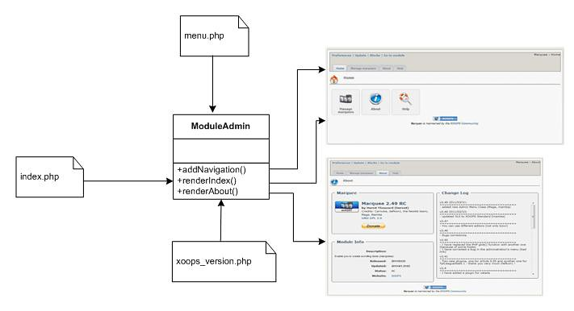

The "ModuleAdmin" class completely manages the admin side of the module. It allows you to:

- Create the index page
- Create the about page
- Create Action buttons on all Admin pages


## 2 Installation

The framework is already part of XOOPS, so there is nothing that you need to do 


## 3 Usage

### 3.1 Configuration of xoops_version.php

In order to use the Framework, you have to add the lines below in your xoops_version.php : To list authors :
```php 
$modversion['author'] = 'Author1,Author2,Author3';
```
You can set as much authors of the module as you want, but it is necessary to separate them with a comma.
$modversion['nickname'] = 'Pseudo1,Pseudo1,Pseudo3';
You must put the same number of usernames used for authors Username1 = Author1, etc. Usernames are separated with a comma.
```php 
$modversion['website'] = 'www.website.com'; $modversion['name_website'] = 'website';
```
For the variable website, you must put the url of your site and for the variable name_website, it is necessary to put the title of your website
```php 
$modversion['license'] = 'GNU GPL'; 
$modversion['license_url'] = 'https://www.gnu.org/licenses/gpl-2.0.html/';
```
For the variable license, you must put the type of license and for the variable license_url, it is necessary to put the url of the license.

```php 
$modversion['status_version'] = 'version number';
```
You must indicate the status of your module. The status are the following :

*	**Alpha**: The Alpha versions are the first versions of the module, lot of bugs exist in such versions and lot of features still missing. So it's necessary to dont use this version in a productive website.
*	**Beta**: The versions Beta are more advanced than Alpha. Bugs exist again, but almost all the functionalities of module are present. So it's necessary to dont use this version in a productive website.
*	**RC**: Which means "release candidate", the RC versions they are enough advanced to be distributed to any user. It is not advisable to use them in a productive website.
*	**Final**: This is the final version of the module it can be installed and used in a productive website.

All the versions, except the final one, can be followed by a number to differentiate several versions.
```php 
$modversion['release_date'] = 'year/month/day';
```

Date of the publication of the version. This date must have the format: 'year/month/day'
The Framework will handle automatically the translation of the date in the appropriate format according the website language.
```php 
$modversion['help'] = 'page=help';
```
Allow you to specify the template of the help page od the module also to create the help menu.

$modversion['min_php'] = '5.2';
Vou have to specify the minimum php version required to a good working of the module. Anyway, you need at least 5.2, because the Framework does not work on an earlier version.
```php 
$modversion['min_xoops'] = '2.5';
```
You have to specify the minimum xoops version required to a good working of the module. Anyway, you need at least 2.5, because the Framework does not work on an earlier version.
```php 
$modversion['system_menu'] = 1;
```
Since the version 2,5 of xoops, the system module generates automatically the administration menu if we add this line.
All these parameters are required to use the Framework.

### 3.2 Configurations of the usage of the Frameworks

To use this Framework in an adequate way, it is necessary to create a function that allows to verify if it is present on the website. 
This precaution will avoid a white page to the user if the Framwork doesn’t exist. This function can also include the file "moduleadmin.php".
```php 
function modulename_checkModuleAdmin()
{
    if (file_exists($GLOBALS['xoops']->path('/Frameworks/moduleclasses/moduleadmin/moduleadmin.php'))) {
        include_once $GLOBALS['xoops']->path('/Frameworks/moduleclasses/moduleadmin/moduleadmin.php');
        return true;
    } else {
        echo xoops_error("Error: You don't use the Frameworks \"adminmodule\". Please install this Frameworks");
        return false;
    }
}
```
modulename must be replaced by the module title. This function is placed in functions.php:

* modulename 
    * include
      * functions.php.

This function is used as follows: whenever we want to use the framework:
```php 
if (modulename_checkModuleAdmin()){ 
    $variable_name = new ModuleAdmin(); 
}
```
It is not mandatory to use this feature. If you are sure the frameworks is used, you just put this line to use: :
```php 
include_once $GLOBALS['xoops']¬>path('/Frameworks/moduleclasses/moduleadmin/moduleadmin.php');
```

### 3.3 The admin menu
To create the administration menu, we put in xoops_version.php :
```php 
$modversion['system_menu'] = 1;
```
This instruction automatically enables a navigation menu inside the administration area of the module:

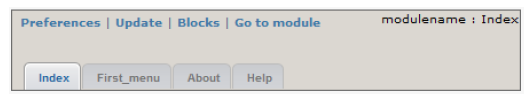

The upper part is automatically generated and tabs are created by the menu.php file located in :

* modulename 
  * admin 
    * menu.php.


The menu.php file must have the following structure :
```php 
$adminmenu[1]['title'] = _MI_MODULENAME_INDEX;
$adminmenu[1]['link']  = "admin/index.php";
$adminmenu[1]['icon']  = "images/admin/home.png";
$adminmenu[2]['title'] = _MI_MODULENAME_FIRSTMENU;
$adminmenu[2]['link']  = "admin/firstmenu.php";
$adminmenu[2]['icon']  = "images/admin/firstmenu.png";
$adminmenu[3]['title'] = _MI_MODULENAME_ABOUT;
$adminmenu[3]['link']  = "admin/about.php";
$adminmenu[3]['icon']  = "images/admin/about.png";

```
```php 
$adminmenu[id]['title']
```
Variable in which you indicate the title of the link.
```php 
$adminmenu[id]['link']
```
Variable in which you specify the link path
```php 
$adminmenu[id]['icon']
```
Variable in which you specify icons path. This icon is used by the admin theme and by the index menu generated by the Framework. The icons to the page "index" and "about" should always be the same, for the other icons you are free. All icons should have a size 32px / 32px

### 3.4 The help section of the module
To create a help section we added in xoops_version.php :
```php 
$modversion['help'] = 'page=help';
```

This instruction automatically enables a help button in the navigation tab of the module's administration :

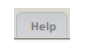

Also,It enables to create a menu in the admin index page :

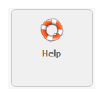

The help template exists is in the language file so it can be translated for each language. The structure is as follows :

* modulename
  * language
    * english
      * help
        * help.html
      
Please view the template help TDMDownloads module to see how it is constructed.

### 3.5 Addition of a info box

The info box is a text zone composed from a title and of a text. To create a infobox, we use addInfoBox() :
```php 
$variable_name->addInfoBox($title);
```

| Variable | Info | 
| :--- | :--- | 
|$title : | Linfo box title.|

To add a line in the linfo box, we use addInfoBoxLine() :
```php 
$variable_name->addInfoBoxLine($title, $text, $value, $color, $type);
```
| Variable | Info | 
| :--- | :--- | 
|$title  |Info box title (similar to the one used with "addInfoBox"). 
|$text  |Text to be shown in the info box. 
|$value  |Value to appear in the text. 
|$color  |Value color. 
|$type  |Values: 'default' or 'information'.

The type 'default' uses all the parameters. It displays a text that includes the variable $value of the color 'color'.

#### Example:

```php
$variable_name->addInfoBox("Title"); 
$variable_name->addInfoBoxLine("Title", 'Text %s and...', 'value', 'red', 'default');
```
The result:

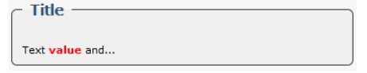

The type 'information' uses only the parameters '$text'. It displays only a text. 

#### Example:
```php
$variable_name->addInfoBox("Title"); 
$variable_name->addInfoBoxLine("Title", 'Text', '', '', 'information');
```

The result:

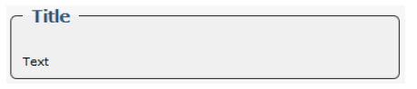


To display the infos box, we use renderInfoBox() :
```php
$variable_name -> renderInfoBox();
```

Infos box are automatically displayed in the pages "index.php" and "about.php" if you are using functions that handle these parts.
You can add as many lines as you want in a info box and you can put as many infos box as you wish. Those are the infos box title that can link the right lines with the correct infos box.
#### Example:
```php
$variable_name = new ModuleAdmin(); 
$variable_name->addInfoBox("bike"); 
$variable_name->addInfoBox("car"); 
$variable_name->addInfoBoxLine("bike", 'Text1', '', '', 'information'); 
$variable_name->addInfoBoxLine("bike", 'Text2', '', '', 'information'); 
$variable_name->addInfoBoxLine("car", 'Text3', '', '', 'information'); 
echo $variable_name -> renderInfoBox();
```
The result:

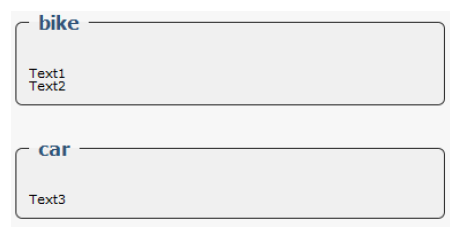


### 3.6 Addition of a navigation

The navigation allows to put a picture with the title of the section where we are. The image and title are automatically created.
To add navigation we use addNavigation() :
```php
$variable_name->addNavigation($file);
$file : Page title with extension (note, put the same names as those in menu.php). 
```

#### Example :
```php
$variable_name = new ModuleAdmin(); 
$variable_name->addNavigation("fist_menu.php"); 
echo $variable_name -> renderLabel();
```

The Result:

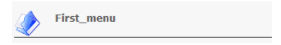

### 3.7 Addition of a button

The button is composed from an image and a title,it allows to create a link. To create a button, we use addItemButton() :
```php
$variable_name->addItemButton($title, $link, $icon, $extra);
```
| Variable | Info | 
| :--- | :--- | 
|$title |Link title. 
|$link  |Url of the link. 
|$icon  |Image that exists before the link. Values are: 'add' or 'list'. 
|$extra  |Text after the title.


To display the buttons, we use renderButton() :
```php
$variable_name -> renderButton($position, $delimeter);
```
| Variable | Info | 
| :--- | :--- | 
|$position | Position of the buttons. Values are: 'left', 'center' or 'right'. 
|$delimeter | Demarcation between the buttons. By default ' '.

We can add as many buttons as we need.

#### Example:

```php
$variable_name = new ModuleAdmin(); 
$variable_name->addItemButton('Link title', 'index.php', 'add' , ''); 
$variable_name->addItemButton('Link title', 'index.php', 'add' , 'extra'); 
$variable_name->addItemButton('Link title', 'index.php', 'list' , ''); 
echo $variable_name->renderButton('left', '');
```

The result:

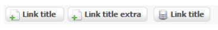


### 3.8 The page "index.php"

The index page is composed from 3 parties :

1. A menu (automatically generated).

2. Custom infos box if desired.

3. A configuration info box. 

To create an index, we use renderIndex() :
```php
   $variable_name->renderIndex();
```   
By default there are only 2 configurations listed :
   1.	PHP Version (recovered from the variable $modversion['min_php'] inside xoops_version.php).
   2.	XOOPS version (recovered from the variable $modversion['min_xoops'] inside xoops_version.php).

If both variables are defined in xoops_version.php, we get automatically this info box :

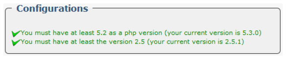

We can add 3 other types of configuration.
1. Display text.
2. Verifying the existence of a file.
3. Checking the chmod of a file. 
 
To add a configuration line, on we use addConfigBoxLine() :
```php
   $variable_name->addConfigBoxLine($value, $type);
```
| Variable | Info | 
| :--- | :--- | 
| $value : With type 'folder' we have to put the folder path. With type 'chmod' we have to put a table with the folder path as a first parameter and the desired chmod as as a second one. 
|$type | 'default', 'folder' or 'chmod'.

#### Example :
```php
$variable_name = new ModuleAdmin(); 
$variable_name->addInfoBox("Title"); 
$variable_name->addInfoBoxLine("Title", 'Text %s ...', 'value', 'red', 'default'); 
$variable_name->addConfigBoxLine('----Hello world----', 'default'); $folder = XOOPS_ROOT_PATH . '/uploads/modulename/'; 
$variable_name->addConfigBoxLine($folder, 'folder'); 
$variable_name->addConfigBoxLine(array($folder, '777'), 'chmod'); 
echo $variable_name->addNavigation('index.php'); 
echo $variable_name->renderIndex();
```
The Result:

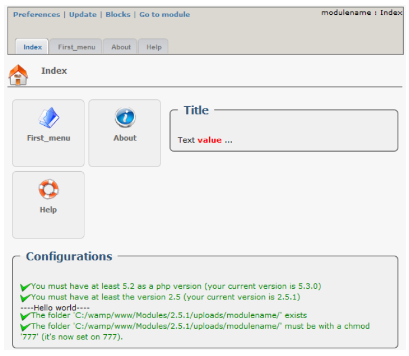


### 3.9 The page "about.php"
The page "About us" is composed from 4 parts :

1.	A summary of the module information (automatically generated from xoops_version-php) as a info box.
2.	Custom infos box if desired.
3.	A info box with information about the module (automatically generated from xoops_version¬php).
4.	The module's changelog.

To create the page "About us", we use renderabout() :
```php
$variable_name->renderabout($paypal, $icon);
```
| Variable | Info | 
| :--- | :--- | 
|$paypal | Your payal ID,if you want a "donate" button so users can make donations. 
|$icon| Values 'True' if you want to put xoops image in the footer and 'False'if you do not want.

The changelog will be automatically loaded, but you must put in:

* modulename
  * docs
    * changelog.txt
    
And in :
* modulename 
  * language 
    * Language 
      * changelog.txt

 The changelog will be automatically loaded into the language of the website. If no, it will be loaded from the folder "docs".

    You can also add as many linfos box as you want in this section

#### Example
```php
$variable_name = new ModuleAdmin(); 
$variable_name->addInfoBox("Title"); 
$variable_name->addInfoBoxLine("Title", 'Text %s ...', 'value', 'red', 'default'); 
echo $variable_name->addNavigation('about.php'); 
echo $variable_name->renderabout('9MYQB7GUK5MCS', true);
```
The result: 

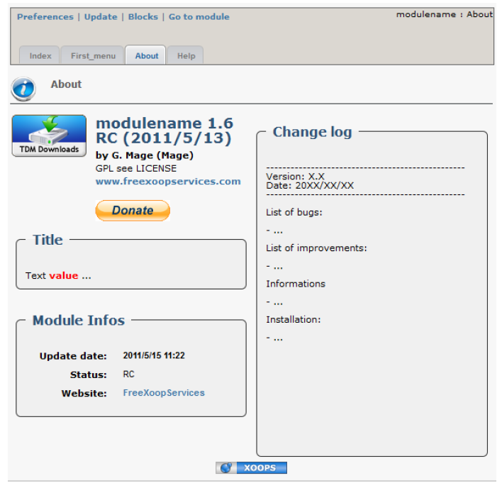

### Credits:
This tutorial about the ModuleAdmin Framework was originally created by **Free XOOPS Services** Team from XOOPS France. 
